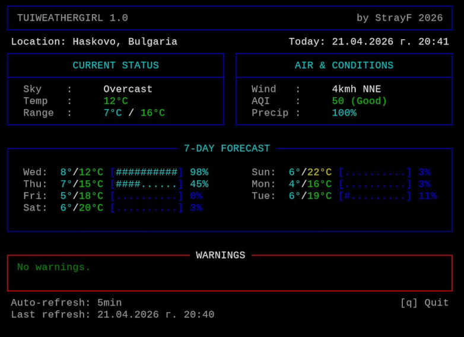

# TUIWEATHERGIRL: YOUR DAILY TERMINAL WEATHER GIRL



## DESCRIPTION

Terminal application to display the daily and weekly weather forecast.

The application was written with the most basic to modern terminals in mind and paying special attention to ease the API calls and prevent the APIs being called too often while still being useful to the user.

The application have minimal dependencies (only `python3-babel`) and is portability-centric.

## FEATURES

NOTE: Features marked with an asterisk (*) are automatically converted to the appropriate format and units for the current location. Therefore supported temperature units are Celsius and Fahrenheit, as well as speed units will be displayed in MpH and KpH accordingly.

- Display:
  - Location
  - Time and date*
  - Current sky condition
  - Current temperature*
  - Today's minimum and maximum temperatures*
  - Current wind speed and wind direction*
  - Current Air Quality Index (AQI)
  - Today's precipitation probability
  - 7 day weather forecast with minimum/maximum temperatures and precipitation probability
  - A dangerous weather warning
- Several cachine methods to ease the API calls and prevent being banned
- Different views, ranging from simple prints for super basic terminals to colorful views for modern terminals

## USAGE

```bash
tuiweathergirl [--help|<VIEW>]

VIEWS:
    --simple
        Best for barebone terminals.
        Simple print of the date, time, weather data and then exit.

    --nice
        Still nice for barebone terminals.
        Basic text interface with tables (ncurses).
    
    --color
        This is just the Nice view, but with colors.

    --fancy
        Better for moderate to modern terminals.
        Color text interface.

    --glamour
        ***WIP***
```

## INSTALLATION

```bash
make install
```
