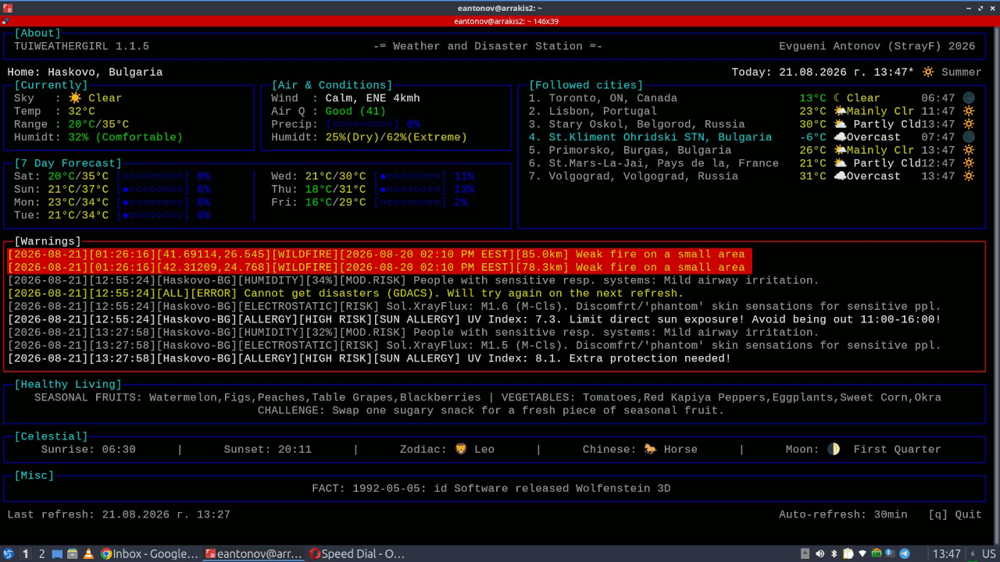

# TUIWEATHERGIRL: Weather and Disaster Station



## DESCRIPTION

Personal weather and disaster terminal application for everyday use.

This application was designed with maximum inclusivity for individuals with health sensitivities, including photosensitivity (sun allergies), respiratory conditions (such as asthma), geomagnetic sensitivities etc. Its goal is to assist users by providing warnings for dangerous or risky weather conditions.

It features alerts for regional disasters, space weather, and various other public safety events.

Built to run on everything from basic legacy terminals to modern terminal emulators, the application prioritizes performance by optimizing API calls and preventing rate-limit issues, resulting in a low-overhead experience.

The application has minimal dependencies and is designed with a strong focus on portability.

> Not vibe-coded.

## TESTED ON

1. Lubuntu 24.04.4 LTS x86_64 linux
2. Windows 10

> The application was never tested on MacOS. I am providing installation instructions, but please do let me know if you had any installation issues and how you solved them. Thanks!

## FEATURES

> Features marked with an asterisk (*) are automatically converted to the appropriate format and units for the current location. Therefore supported temperature units are Celsius and Fahrenheit, as well as speed units will be displayed in MpH and KpH accordingly.

> Not all metrics are displayed on each view

- Display:
  - Location
  - Time and date*
  - Current sky condition
  - Current temperature*
  - Today's minimum and maximum temperatures*
  - Current wind speed and wind direction*
  - Current Air Quality Index (AQI)
  - Today's precipitation probability
  - 7 day weather forecast with minimum/maximum temperatures and precipitation probability
  - Dangerous weather condition warnings
  - Health hazard warnings
  - DST
  - Day/night
  - Wind type assessment
  - Precipitation type assessment
  - Up to 10 additional cities available to monitor for time and temperature
- Robustness:
  - Several cache methods to ease the API calls and prevent being banned
- Extensibility:
  - Different views, ranging from simple prints for super basic terminals to colorful views for modern terminals
  - Color themes
- Flexibility:
  - Application can handle scenario when user is behind VPN and still provide the relevant data for their home location
- Accessibility:
  - Convenient for people using screen-reading software
- Portability:
  - The application makes use of few external libraries, everything else used are core libraries
  - The application was written as a single file to simplify the portability
- Usability:
  - Extensive help screen with detailed description of the application

## DEPENDENCIES

1. Python 3
2. `python3-babel`
3. `python3-requests`
4. `libncurses6`
5. `tzdata`

## INSTALLATION

MANDATORY ACQUISITION OF TIMEZONEDB API KEY:
1. Create a *FREE* account on https://timezonedb.com/
2. Get a *FREE* API key
3. Create an environment variable called TIMEZONEAPIKEY and set the API key as a value. See the examples below.

> The application will not work without this API key set in the environment

If you want detailed wildfire information provided, please consider getting a *free* API key from NASA FIRMS:
1. Go to https://firms.modaps.eosdis.nasa.gov/api/map_key and follow the steps to get the *free* API key
2. Create an environment variable called NASAFIRMSAPIKEY and set the API key as a value

If you don't have it, you must get `PYTHON 3` (get the latest): https://www.python.org/downloads/

[📥 Download TUIWEATHERGIRL application (tuiweathergirl.zip)](https://github.com/StrayFeral/tuiweathergirl/releases/latest/)

### LINUX/UNIX

```bash
printf "export TIMEZONEAPIKEY=PUT_YOUR_API_KEY_HERE\n" >> ~/.profile
source ~/.profile
make install
```

### WINDOWS10

```batch
setx TIMEZONEAPIKEY "PUT_YOUR_API_KEY_HERE"
windows_install.bat
```

> After `windows_install.bat` finishes running, it will create an application shortcut, which you may copy around and use to run the app.

### MACOS

> Please keep in mind this app was never tested on MacOS. Please do let me know if you had any installation issues and how you solved them. Thanks!

If you already have `homebrew` installed:

```bash
brew install python ncurses && pip3 install requests babel
```

If not:

```bash
/bin/bash -c "$(curl -fsSL https://raw.githubusercontent.com/Homebrew/install/HEAD/install.sh)"
brew install python ncurses
pip3 install requests babel
```

## USAGE

> Please consult the help screen for the most up-to-date command-line options

```bash
tuiweathergirl --help
```

For a full list of the application files with full path, you can run:

```bash
tuiweathergirl --listfiles
```

After the very first run, the application would auto-configure itself and will create the configuration file. You are not required to modify it, as there are command-line options to do it, but you are free to do so if you wish.

If you mess it up and the application start throwing errors, just delete it and run the appliation again. It will create new configuration file, filled with the proper data.

If anything else got messed up, _before_ a new application run you might want to

```bash
tuiweathergirl --clearcache
```

But beware - this would gather fresh data from all APIs, so if you do this too often you may choke the APIs and may get banned.

> If you are behind VPN, still let the application detect your location, then add the city you're actually in manually with the `--addcity` option, then use the `--sethome` option to set which city is your actual home and optional you may then remove the fake city using `--removecity`.

> If your internet connection is slow for any reason, you may want to increase the API call request timeout, using `--requesttimeout`

### CHANGING THE SETUP

Some of the things could be changed command-line. For example if you run the app just with 

```bash
tuiweathergirl
```

It will run using the default view, default theme, default request timeout and other defaults. But the moment you run using either:

1. `--view`
2. `--theme`
3. `--requesttimeout`

Any of these parameters would also change the default choice saves in the application config file. This is why for these options you do not need to edit the config file manually. So for example, if you run

```bash
tuiweathergirl --theme basic
```

The next time you run just `tuiweathergirl` it will assume that `basic` view is now your default view and will use it from now on, unless you run again with `--view` parameter to change the default view to something else. `--theme` and `--requesttimeout` work the same way - if you run the app with any of these set, they would change their defaults in the config file.

You may take a look what's in the config file under `[PREFERENCES]`, in case you want to change the metric/imperial system or temperature units or 24 to 12 hours time format. You may also want to change the language there, but beware - I never tested this. For now I prefer to keep all data in plain English format.

